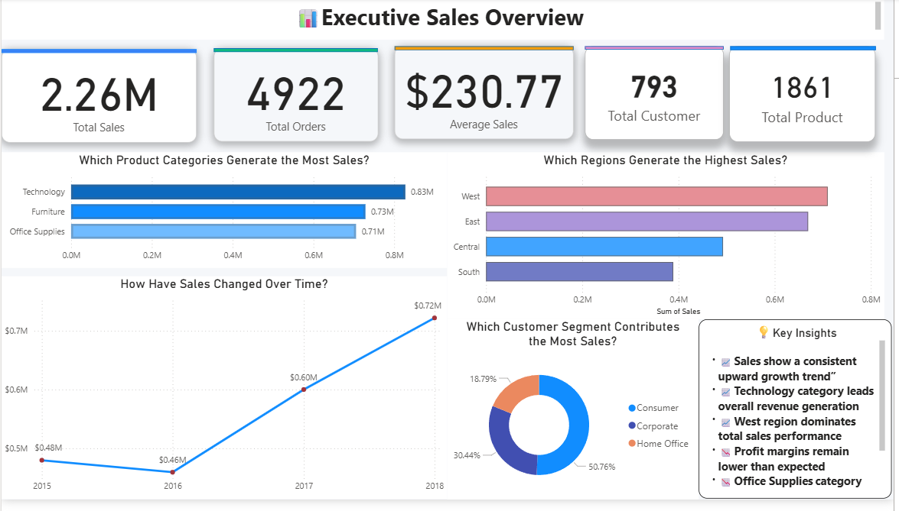
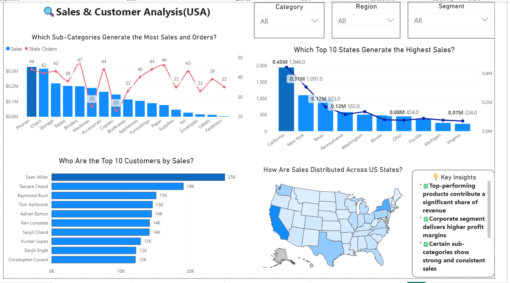
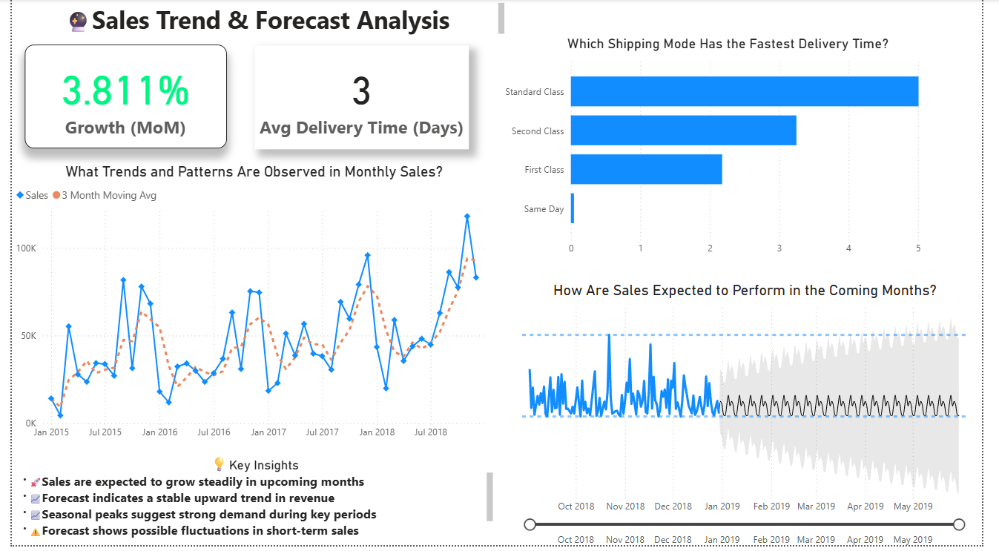
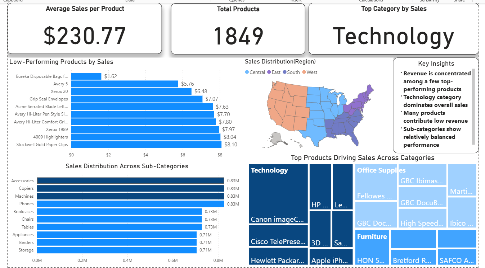

# 📊 Sales Analysis using SQL & Power BI

## 📌 Project Overview

This project presents an end-to-end sales data analysis using SQL and Power BI. It includes data cleaning, exploratory data analysis (EDA), and interactive dashboards to generate business insights.

---

## 📂 Repository Structure

```
sales-analysis-sql-powerbi/
│
├── data/              # Dataset and source details
├── sql/               # SQL queries for analysis
├── powerbi/           # Power BI dashboard file
├── dashboard/         # Dashboard & EDA screenshots
├── analysis/          # Insights and summaries
├── documentation/     # Workflow and design
```

---

## ⚙️ Tools & Technologies

* SQL (Data Cleaning & Analysis)
* Power BI (Dashboard & Visualization)
* CSV Dataset (Superstore)

---

## 📊 Key Insights

* Technology category generates the highest sales
* West region dominates overall revenue
* Discounts negatively impact profit margins
* Sales show consistent growth over time
* Forecast suggests continued upward trend

---

## 📸 Dashboard Preview

### 🔹 Executive Sales Overview



### 🔹 Sales & Customer Analysis



### 🔹 Sales Trend & Forecast



---

## 📊 Exploratory Data Analysis

### 🔹 Category & Product Analysis



### 📌 Insights from EDA

* Technology category dominates overall sales
* Some sub-categories contribute significantly more revenue
* Low-performing products identified for improvement
* Regional distribution highlights performance differences

---

## 🚀 How to Run This Project

### 1️⃣ Clone the Repository

```
git clone https://github.com/your-username/sales-analysis-sql-powerbi.git
```

### 2️⃣ Open Dataset

* Navigate to `/data`
* Use `superstore.csv`

### 3️⃣ Run SQL Queries

* Open `/sql/analysis_queries.sql`
* Execute queries in MySQL / PostgreSQL

### 4️⃣ Open Power BI Dashboard

* Open `/powerbi/superstore_sales_dashboard.pbix`
* Click **Refresh**

##🚀 How to Use

Download the .pbix file from /powerbi
Open using Power BI Desktop
Explore interactive dashboards
---

## 🔄 Project Workflow

1. Data Collection
2. Data Cleaning using SQL
3. Exploratory Data Analysis (EDA)
4. Dashboard Creation in Power BI
5. Insight Generation

---

## 👤 Author

**Samson Pillai**


